# DevOps.WebAPI — Midterm

A small .NET Web API used as a vehicle for setting up a full DevOps workflow: CI pipeline, infrastructure-as-code, blue-green deployment with rollback, and basic monitoring. The app itself is a calculator plus a person-categorization endpoint — the focus is on the surrounding automation, not the API.

## Tech stack

- C# / .NET 10, ASP.NET Core Web API
- xUnit for unit tests
- Docker (multi-stage build) and Docker Compose for orchestrating the blue/green/nginx setup
- nginx (Alpine) as the reverse proxy that does the traffic switching
- GitHub Actions for CI (lint and tests)
- Python 3 for the IaC, deployment, rollback, and monitoring scripts
- prometheus-net for the /metrics endpoint, Serilog for structured JSON logging
- Prometheus and Alertmanager for metrics and alerting, Grafana for dashboards
- Loki and Promtail for log aggregation

## Repository layout

- `DevOps.WebAPI/` — the API, including `Observability/` (metrics middleware and counters)
- `TestProject1/` — xUnit tests
- `infrastructure/setup.py` — IaC script
- `infrastructure/start.py` — brings up blue-green deployment and observability stack
- `infrastructure/verify.py` — validates compose files and runs a post-build smoke test
- `deployment/` — docker-compose, nginx configs, deploy and rollback scripts
- `monitoring/healthcheck.py` — periodic health check
- `observability/` — the observability stack: docker-compose plus Prometheus, Alertmanager, Grafana, Loki and Promtail configs
- `docs/incident-response.md` — incident response runbook and SLO
- `.github/workflows/main.yml` — CI
- `Dockerfile` — multi-stage build for the API

## Endpoints

- `GET /api/Health` — health check, used by monitoring and deploy readiness
- `GET /api/calculator/{operation}/{a}/{b}` — dynamic route, supports add/subtract/multiply/divide
- `POST /api/person/categorize` — input endpoint, takes `{username, name, age}` JSON
- `GET /metrics` — Prometheus metrics, including the custom `app_requests_total` and `app_errors_total` counters
- `GET /simulate-error` — returns 500 on purpose, used to drive the error counter for the alert demo
- `GET /simulate-error/burst?count=N` — generates N errors in one call to cross the alert threshold quickly

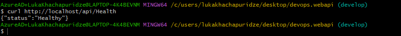

## Setup

You need Docker Desktop (or Docker on Linux) and Python 3. The setup script handles the rest.

    python infrastructure/setup.py

What it does: on Debian/Ubuntu installs Docker via apt if missing; on Windows/macOS verifies Docker Desktop is installed (manual install required); verifies the Docker daemon is running and Docker Compose is available; creates the monitoring/logs, deployment, and observability directories; pre-pulls the .NET 10 SDK, ASP.NET runtime, nginx Alpine, and observability images (Prometheus, Alertmanager, Grafana, Loki, Promtail) so the first deploy is faster.

To start the full local environment in one step:

    python infrastructure/start.py

That builds and starts the blue-green deployment and the observability stack. The blue-green API is on port 80 (via nginx), with blue on 8080 and green on 8081. The observability API runs on port 8082 so it does not clash with the blue container on 8080. Grafana is on 3000, Prometheus on 9090, Alertmanager on 9093.

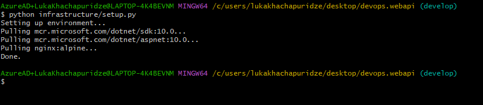

## CI pipeline

Defined in .github/workflows/main.yml. Two jobs, sequential:

1. Code Linting — runs `dotnet format --verify-no-changes`. If formatting is off, this fails and the test job is skipped.
2. Run Unit Tests — dotnet restore, dotnet build, dotnet test on Ubuntu. Uses `needs: lint` so it only runs when linting passes.

Triggered on every push and pull request to main and develop. The lint-then-test ordering is the quality gate — broken formatting can't even reach the test step.

Two other jobs run in parallel with lint (security) or after test (verify):

- **Security Checks** — dependency vulnerabilities, Gitleaks secrets scan, Trivy config/image scanning.
- **Environment Validation** — `docker compose config` on both compose files, then builds the API image and smoke-tests `GET /api/Health` in a temporary container.

The same smoke test can be run locally after a deploy or build:

    python infrastructure/verify.py

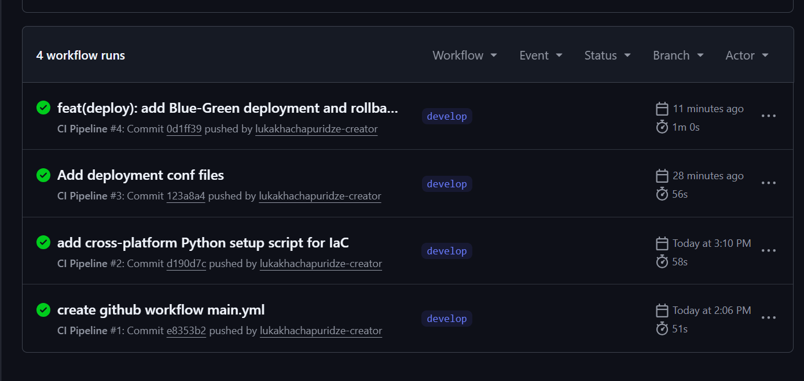

## Security

Security checks run in CI on every push and pull request. The pipeline job does four things:

1. **Dependency vulnerability scan** — `dotnet list package --vulnerable` flags known CVEs in NuGet packages and fails the job if any are found.
2. **Secrets scan** — Gitleaks scans the repository for hardcoded passwords, tokens, and API keys.
3. **Config validation** — Trivy scans the Dockerfile and docker-compose files for misconfigurations (CRITICAL/HIGH severity).
4. **Container image scan** — the CI build produces the API image and Trivy scans it for known vulnerabilities in the base layers.

For local secrets, Grafana credentials are not hardcoded in compose anymore. Copy `.env.example` to `.env` and set `GRAFANA_ADMIN_USER` and `GRAFANA_ADMIN_PASSWORD`. The file is git-ignored. Running `python infrastructure/setup.py` creates `.env` from the example automatically if it does not exist yet.

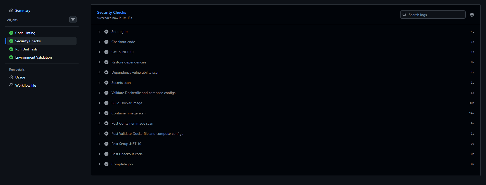

## Reliability

The project already had rollback and deploy-time health checks. I added a few more pieces to make recovery automatic and failures visible.

**Automatic restart.** All services in both compose files use `restart: unless-stopped`. If a container exits unexpectedly, Docker brings it back without manual intervention.

**Docker health checks.** The API containers poll `/api/Health` with curl. nginx, Prometheus, Alertmanager, Grafana, and Loki each have their own health endpoint check. nginx waits until both blue and green are healthy before starting; Prometheus waits for the app; Grafana waits for Prometheus and Loki.

**Service-down alerting.** Besides the error-rate alert, Prometheus now fires `AppDown` (critical) when it cannot scrape the application `/metrics` endpoint for one minute.

**SLO.** The target is 99% availability for the public health endpoint over 24 hours (about 14 minutes of error budget per day). Details and response steps are in `docs/incident-response.md`.

**Existing reliability features still in place:** blue-green deploy with a health gate before traffic swap, one-command rollback, and the external `healthcheck.py` monitor writing UP/DOWN to a log file.

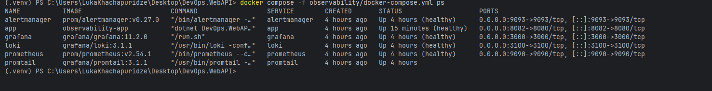

## Deployment — Blue-Green

The deployment runs three containers managed by Docker Compose. Two of them are copies of the API: `app-blue` exposed on host port 8080 and `app-green` on host port 8081. Only one of them is live at any time. The third container is nginx, listening on port 80 and acting as a reverse proxy in front of the two app containers — every public request goes through nginx, which forwards it to whichever color is currently active.

Which color is active is determined by the `nginx.conf` file. There are two template configs, `nginx-blue.conf` and `nginx-green.conf`, that proxy to `blue:8080` and `green:8080` respectively (using Docker network names, not host ports). The active `nginx.conf` is just a copy of one of those two templates. Deploying means: build a new image, restart the idle color with it, verify it's healthy, then overwrite `nginx.conf` with the other template and reload nginx. Rolling back means doing the same swap in reverse — and since the previous color is still running with the previous version, no rebuild is needed.

Bring it up the first time:

    docker compose -f deployment/docker-compose.yml up -d --build

This builds the API image, starts both colors and nginx. By default `nginx.conf` is a copy of `nginx-blue.conf`, so blue is the initial live color.

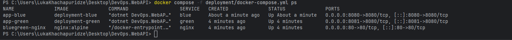

Deploy a new version:

    python deployment/deploy.py

The script reads nginx.conf to figure out which color is currently live, identifies the other color as the deployment target, rebuilds the target container's image from the latest code, restarts the target container with the new image, polls http://localhost:{target_port}/api/Health until it gets a 200 (up to 20 retries, 2s apart), and if healthy, copies nginx-{target}.conf over nginx.conf and reloads nginx. Traffic now flows to the new color; the previous color stays running with the old version. If the health check fails, the script aborts before swapping nginx — the previous version keeps serving traffic and nothing is lost.

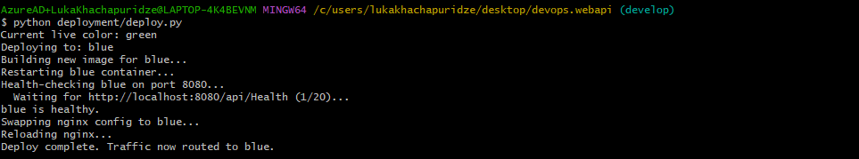

Rollback:

    python deployment/rollback.py

Rollback is fast because the previous color is still running with the previous version. The script just swaps nginx.conf back and reloads. No rebuild, no health check needed — that color was already healthy before we deployed away from it.

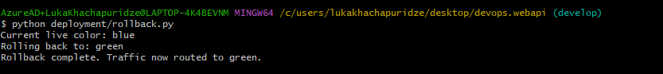

I picked blue-green because the assignment specifically asks for it, and because rollback becomes trivially fast — flipping nginx back is a one-second operation. The downside is that you pay for double the infrastructure (two app containers running at all times instead of one). For a calculator API on a laptop that's not a real cost. In production you'd weigh it against rolling updates depending on what your infrastructure budget looks like.

## Monitoring

    python monitoring/healthcheck.py

Polls http://localhost/api/Health every 5 seconds and writes timestamped results to monitoring/logs/health.log. Each line shows status (UP/DOWN), HTTP status code, and response time in milliseconds. Press Ctrl+C to stop.

To demo failure detection, while the monitor is running you can stop the live container in another terminal with `docker stop app-blue`. The monitor will start logging DOWN entries. Bringing the container back with `docker start app-blue` recovers it.

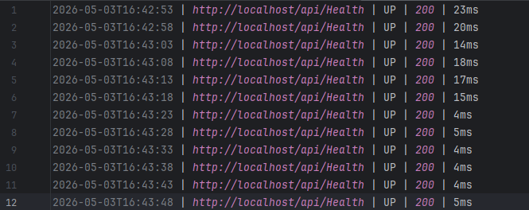

## Observability — metrics, logs, alerting

The monitoring script above is a simple liveness check. The observability stack is the full picture: metrics collection, log aggregation, dashboards, and alerting, all wired together. It lives in its own compose file separate from the blue-green setup, and comes up with a single command:

    docker compose -f observability/docker-compose.yml up -d --build

That starts six containers on one network: the API itself, Prometheus, Alertmanager, Grafana, Loki, and Promtail.

### Architecture and data flow

There are two paths through the system, one for metrics and one for logs, and they meet again in Grafana.

    metrics:  app /metrics  --scrape-->  Prometheus  --query-->  Grafana
                                             |
                                             +--fires-->  Alertmanager   (error rate > 5/min)

    logs:     app JSON logs  --tail-->  Promtail  --push-->  Loki  --query-->  Grafana

The API exposes counters at `/metrics`. Prometheus scrapes that endpoint every 15 seconds and stores the values. Grafana queries Prometheus to draw the dashboard, and when the error rate crosses the threshold Prometheus fires an alert to Alertmanager. On the logging side, the API writes structured JSON to stdout and to a file under `/app/logs`; Promtail tails those files and pushes the lines to Loki; Grafana queries Loki so the logs sit next to the metrics on the same dashboard.

Ports: Grafana on 3000 (credentials from `.env`), Prometheus on 9090, Alertmanager on 9093, Loki on 3100, and the observability API on 8082 when the full environment is running (8080 when you start only the observability stack).

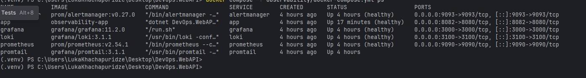

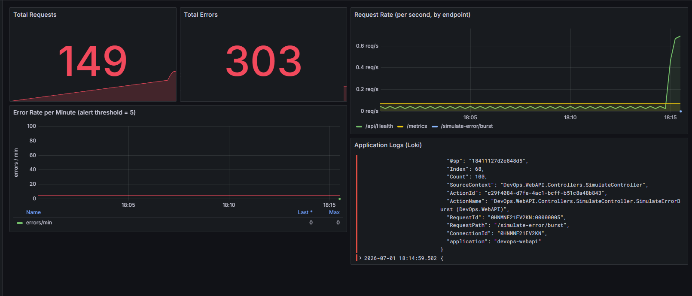

### Instrumentation

The metrics come from prometheus-net. `UseHttpMetrics()` gives the standard request duration and in-flight metrics for free, and a small custom middleware (`DevOps.WebAPI/Observability/`) increments two counters on every request: `app_requests_total` for all requests and `app_errors_total` for any response with a status code of 500 or above, or any unhandled exception. Both carry method, endpoint, and status code labels. `MapMetrics()` exposes everything at `/metrics`.

### Logging strategy

Logging is handled by Serilog, configured in `Program.cs`. I write logs in JSON rather than plain text so they can be parsed and queried instead of just grepped. The format is Serilog's compact JSON (CLEF) — each log line is a self-contained JSON object with a timestamp, level, message template, and any structured properties. Logs go to two places: the console, which is what gets captured in a container, and a rolling daily file under `/app/logs`. Every line is enriched with an `application` property so it can be filtered in Loki.

For shipping I went with Loki plus Promtail rather than the ELK stack. Both would satisfy the requirement, but Loki is much lighter on memory and disk than Elasticsearch, indexes by labels instead of full text, and integrates directly into Grafana so I don't need a separate log UI. Promtail tails the JSON files from a volume shared with the API, parses each line, promotes the log level to a label, and pushes to Loki. For a lab running on a laptop the lower resource footprint matters; in a larger setup where you need full-text search across huge volumes of logs, ELK would be the stronger choice.

### Triggering the CRITICAL alert

The alert rule is in `observability/prometheus/rules/alert.rules.yml`. It evaluates `sum(rate(app_errors_total[1m])) * 60 > 5` — the error count over the last minute expressed as errors per minute — and fires a `critical` severity alert called `HighErrorRate` when that goes above 5.

To trigger it, generate more than five errors inside a minute against the observability API (port 8082 when the full environment is running via `start.py`, or 8080 if you started only the observability stack). The quickest way is the burst endpoint, which produces ten errors in a single call:

    curl http://localhost:8082/simulate-error/burst?count=10

Or hit the single-error endpoint in a loop:

    for ($i=0; $i -lt 10; $i++) { curl http://localhost:8082/simulate-error }

Within about a minute the error rate crosses 5 per minute. The alert shows up as FIRING on the Prometheus Alerts page (http://localhost:9090/alerts), gets forwarded to Alertmanager (http://localhost:9093), and the error-rate panel in Grafana crosses the red threshold line drawn at 5.

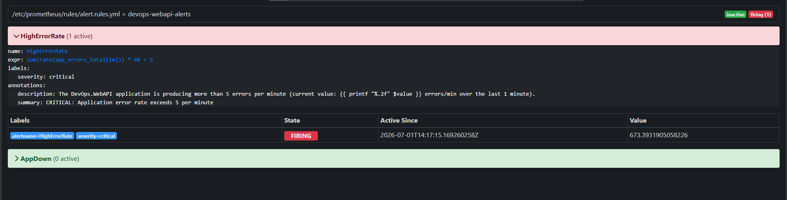

## Local development without containers

If you want to run the API directly without going through Docker:

    dotnet run --project DevOps.WebAPI

Tests:

    dotnet test

The container setup is only needed for the blue-green demo.

## Workflow

When I push a commit, GitHub Actions picks it up and runs the lint job first. If formatting is wrong, that job fails and the test job is skipped — the pipeline stops there. If lint passes, the test job runs `dotnet restore`, `dotnet build`, and `dotnet test`. If any test fails, the run is marked failed.

Once CI is green I deploy locally by running `python deployment/deploy.py`. The script figures out which color is currently live by reading `nginx.conf`, builds a new image for the other color, restarts that container, and polls its health endpoint until it responds. If the new container becomes healthy, the script swaps `nginx.conf` to point at it and reloads nginx — traffic now flows to the new version. If the new container never becomes healthy, the script aborts before swapping, so the previous version keeps serving requests.

If something is wrong with the deployed version, `python deployment/rollback.py` flips traffic back. The previous color is still running with the previous version, so rollback is just a config swap and nginx reload — no rebuild, no waiting.

Throughout all of this, `python monitoring/healthcheck.py` can run in a separate terminal, polling `/api/Health` every five seconds and writing UP/DOWN status to a log file.

## Branches

- main — stable milestones
- develop — active work, all feature commits land here first

CI runs on both. When a feature is finished and tests pass on develop, develop is merged into main.

## Notes / known limitations

- The blue-green setup runs entirely on a single host (your machine). In real production you'd run blue and green on separate machines or pods. The mechanism is the same; only the scale changes.
- The monitor polls localhost. If the grader's machine doesn't have the stack running when they look at the script, the log will be empty — that's why a screenshot of a live run is included.
- The IaC script auto-installs Docker only on Debian-family Linux. On Windows and macOS it verifies that Docker Desktop is present, since Docker Desktop install isn't scriptable in the same way.